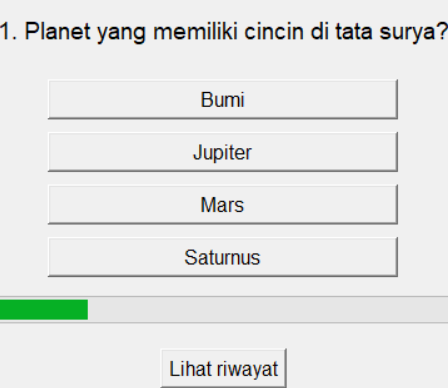

# Quiz App with GUI (Indonesian version)

This is a Python-based quiz application with an interactive graphical user interface (GUI) built using `tkinter`. Test your knowledge across various categories with this fun and engaging quiz app!

---

## Features
- **Randomized Questions**: Questions are shuffled each time the quiz starts.
- **Multiple Categories**: Covers topics like history, science, and math.
- **Leaderboard**: Tracks scores and saves them for future reference.
- **Progress Bar**: Shows how far you are in the quiz.

---

## Example


---

## Requirements
To run this application, you need:
- Python 3.7 or higher
- `tkinter` module (pre-installed with Python)

---

## How to Use

1. **Clone the Repository**:
   ```bash
   https://github.com/rexzea/simple-quiz.git


**Load in Python Terminal**
python quiz_rexzea1.py
